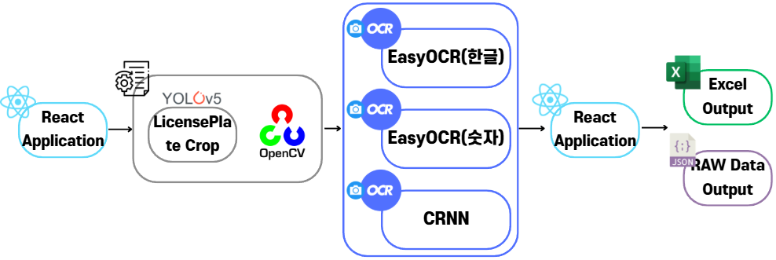
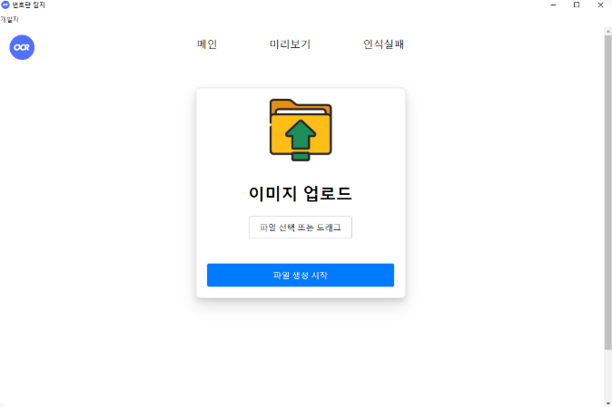
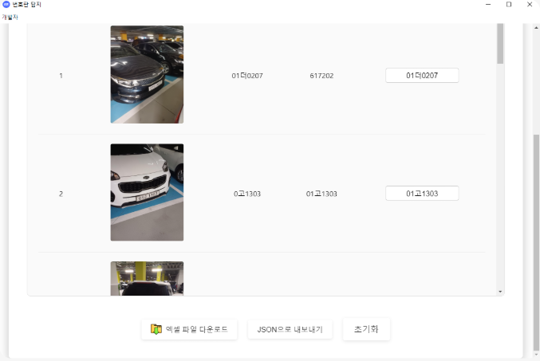
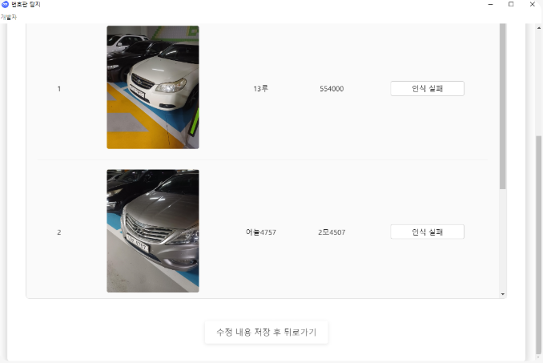
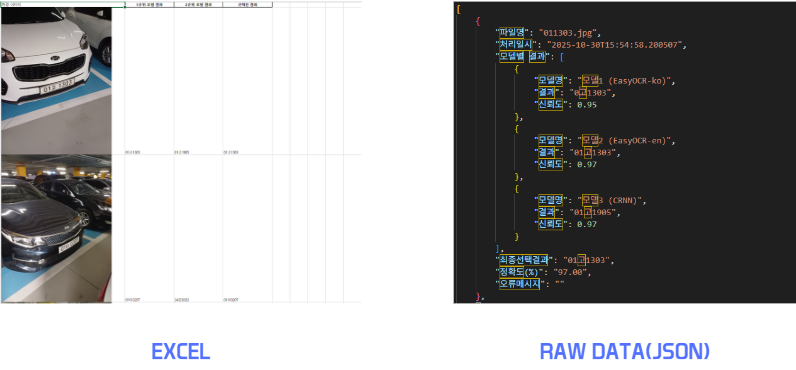

# 차량 번호판 인식 및 문자 탐지 프로그램
> **2025 동아대학교 × 사하구청 현장미러형 연계 협업 프로젝트**
> 시민 신고 사진을 분석하여 차량 번호를 추출하고, 행정 처리용 엑셀 보고서를 자동 생성하는 **로컬 보안형** 시스템입니다.

---

## 프로젝트 성과 (Key Results)
* **업무 효율성 95% 향상**: 385장 처리 기준 기존 수작업(1시간 36분) 대비 **4분 18초**로 단축
* **대외 수상**: 동아대학교 D-STARTUP 창업 패키지 **은상**
* **대외 활동**: K-ICT WEEK IN BUSAN 동아대부스 참가
* **학술 활동**: 2025 한국ITS학회 추계학술대회 학부논문경진대회 논문 투고

---

## 핵심 기능 (Features)

### 1. 고도화된 OCR 파이프라인
* **Detection**: YOLOv5를 이용한 정확한 번호판 영역 실시간 탐지
* **Pre-processing**: 4점 투시 변환(Perspective Transform)을 통한 왜곡 보정, CLAHE(대비 최적화), Bilateral Filter(노이즈 제거) 및 샤프닝 적용
* **Recognition**: EasyOCR 및 자체 학습된 **Custom CRNN** 모델 병렬 운용
* **Post-processing**: 다중 모델 결과 융합(Ensemble), 다수결 기반 후보 선별 및 한국 차량 번호판 정규표현식 기반 유효성 검증

### 2. 보안 및 운영 최적화
* **100% 로컬 구동**: 외부 클라우드 전송 없이 내부 네트워크 내에서만 동작하여 개인정보 유출 위험 원천 차단
* **저사양 환경 지원**: GPU가 없는 관공서 저사양 PC에서도 안정적으로 구동되도록 모델 최적화

### 3. 사용자 편의 기능
* **GUI 수정 모드**: OCR 오인식 발생 시 담당자가 직접 내용을 수정하고 저장할 수 있는 인터페이스 제공
* **결과 자동화**: 인식 결과를 즉시 **Excel(xlsx)** 또는 JSON 형식으로 내보내기 지원

---

## 기술 스택 (Tech Stack)
* **Frontend**: React (Windows 전용 로컬 웹 UI)
* **Backend**: Python (FastAPI/Flask 기반 API 서버), EXE 패키징
* **AI/ML**: YOLOv5, EasyOCR, Custom CRNN, PyTorch
* **Image Processing**: OpenCV
* **Data**: Pandas, Openpyxl

---

## 실행 방법 (Execution Guide)

### 1. APP 모드 (GUI)
1. 압축 파일을 해제하고 `ocr-web.exe` 파일을 실행합니다.
2. 이미지를 업로드한 뒤 분석 버튼을 선택하여 작업을 진행합니다.
3. 완료된 결과에서 수정이 필요한 경우 직접 편집합니다.
   * **Tip**: 이미지 더블클릭 시 확대되며, 확대 상태에서 **상/하 방향키**로 다음 이미지 이동이 가능합니다.
4. 최종 결과물을 **Excel** 또는 **JSON** 형식으로 다운로드합니다.

### 2. API 모드
1. `ocr_server_v2.exe`를 실행하여 서버를 가동합니다.
2. `images/` 폴더 내에 처리할 이미지 파일들을 삽입합니다.
3. `upload.bat`을 실행하여 이미지를 서버로 업로드 및 분석합니다.
4. `download.bat`을 실행하여 결과 데이터를 다운로드합니다.
   * 작업 초기화가 필요한 경우 `reset.bat`을 실행합니다.

---

## 프로젝트 구조

* FlowChart  
 

---

## 기능 예시

* 메인 페이지  

* 미리보기 페이지  

* 인식실패 페이지  

* 최종 출력  

---

## 트러블슈팅 (Troubleshooting)

* **데이터셋 부족 해결**: 보안상 실제 민원 데이터 사용이 불가하여, 팀원이 직접 주차장 등에서 다양한 환경의 번호판을 촬영하여 자체 학습 및 검증 데이터셋 구축
* **환경 비호환성 해결**: 라이브러리 버전 충돌 방지를 위해 개발 환경을 표준화하고 Notion에 기록하여 팀원 간 일관성 유지
* **인식 오류 보정**: 'B'↔'8', 'O'↔'0' 등 오인식 패턴 분석을 통한 정규식 기반 2차 보정 로직 구현 및 적용

---

## 팀원 정보 (Team)
* **김수윤 (팀장)**: 백엔드 개발 및 학습 진행, 일정 조율
* **김륜영**: 풀스택 개발 및 학습 진행, 문서 정리
* **천영기**: 백엔드 개발 및 학습 진행, 문서 정리
* **이승민**: 프론트엔드 개발, PPT 및 문서 정리
* **서인범**: 프론트엔드 개발, PPT 및 문서 정리

---
**지도교수**: 김현석 교수님  
**협업기관**: 부산광역시 사하구청
